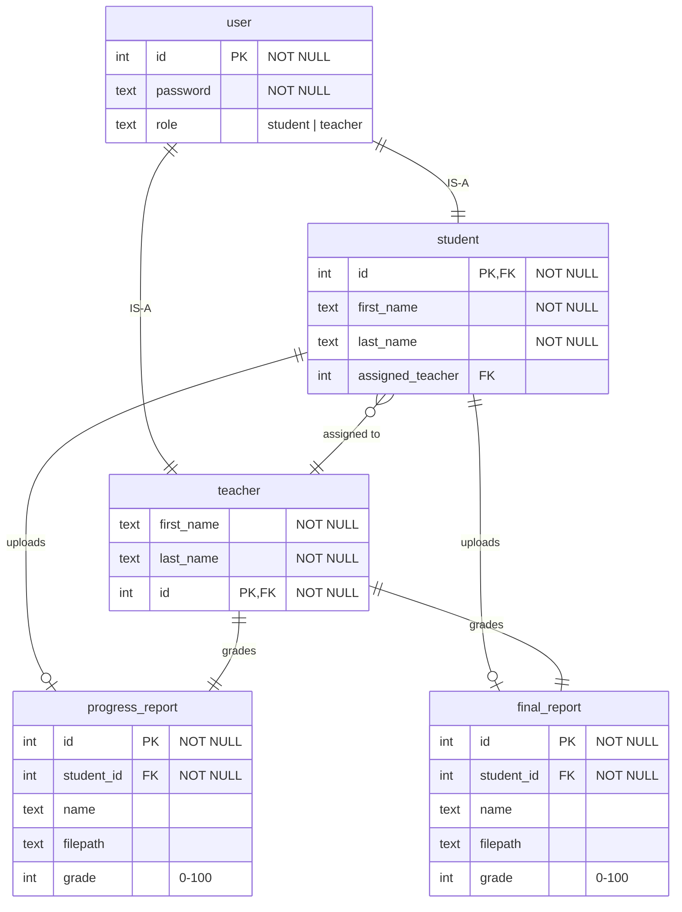

# Dissertation Management System

Given only 3 days and also needing to study for the exams next week, my goal was to just try my best to quickly implement a **minimum functioning** vue frontend and api server + sqldatabase, so there are some rushed/missing design decisions to keep in mind:

- all server functions in 1 source code file `server.js` (instead of structuring into `router`, `utils`, etc)
- admin credentials hardcoded into server code and requires separate API
- no input sanitation/validation
  - assume all text inputs are valid
  - assume all files uploaded are unique / not duplicate names
- download api isn't protected (for easier debugging and dev)
- very simple website design and components, no special vue-router navigation guards for session expiry, duplicate login, etc
- passwords are stored unencrypted instead of hashed (for easier debugging and dev)
- sessions are stored in-memory rather than to the database

but I believe the basic requirements were fulfilled.

## Instructions to Run

**The Vue app has already been built to static files that will be served from `/server/dist` by the server on port `8080` (REST API also on same port)**

### Running the already-built app

```bash
#1 go to server
cd ./server

#2. install dependencies
npm install

#3. start server
npm run serve
```

### Running client as development server

The vue app can also be run from its normal development mode in `client` by Vite, at port `5173`.

```bash
#1 go to client and install dependencies
cd ./client
npm install

#3 go to server and install dependencies
cd ./server
npm install

#3. start client and server (separate terminals)
cd ./client
npm run dev

cd ./server
npm run serve
```

## Requirements Spec

based on original document and follow-up email, I haved designed the system with requirements/assumptions as follows:

- support user accounts using password only. session management using http cookies and express-session. (10 minute sessions)
- 3 types of roles: student, teacher (user accounts via database), admin (1 "account", hardcoded password in backend). each account gets redirected to a different portal.
- ONE teacher can grade multiple students' work.

### Student

- submit 2 reports: progress report, final report
- report file supported types: `.docx`, `.pdf`
- submitted reports can be downloaded (tbc)

### Teacher

- see his/her list of assigned students to mark the reports of
- download the student's reports
- input the grades (0-100) for **each** report; confirm and submit grades for **each** report
- once the final report's grades are confirmed, the record of each student is finalized

### Admin

- view all registered students in the system in a list and see their status:
  - progress and final report files (can download)
  - the grades of each report
  - the teacher responsible for each student
- can add students to the system by
  - entering their details
  - creating a password for them
  - assigning them to a teacher

## System Spec

### App Structure

```text
/ (home page for login)
|__app/
  |__student (uploading reports)
  |__teacher (students list)
  |   |__:studentid  (1 student's page, for grading)
  |__admin (list of all students and teachers)
  |   |__add-student
```

### App Stack

- Frontend: Vue.js 3. Build with Vite
  - Composition API style, Javascript
  - Vue-Router for client side URL routing
- Backend: Express.js on Node
  - session management and auth using cookies
  - SQLite database file
  - a folder to store all the report files from students

## API Spec

HTTP 1.1 REST API provided using `localhost:8080/api`.  

### 1. Login and Logout (Student, Teacher)

enter a password and obtain a httponly cookie

#### Request

| Method | Endpoint | Content-Type | payload |
|-|-|-|-|
|POST|/users|application/json|  { "password": String } |
|DELETE|/users| application/json| - |

#### Response

1. Login (POST)

|Status| Content-Type |Response|
|-|-|-|
|201 Created| application/json | { "user": { <br> "role" : "student \| teacher" <br> "first_name" : String, <br> "last_name" : String } } |
|401 Unauthorized| application/json| { "error": "Incorrect password" }|
<!-- |500 Server Error| application/json | { "error" : "Something went wrong. Please try again later."} | -->

2. Logout (DELETE)

|Status|Content-Type|Response|
|-|-|-|
|204 No Content|-|-|
|401 Unauthorized|application/json|{ "error": "No cookie" }|
<!-- |500 Server Error| application/json | { "error" : "Something went wrong. Please try again later."} | -->

### 2. Login and Logout (Admin)

i hardcoded admin password for simplicity which is why a separate endpoint is needed. also just returns httponly cookie. response has no body.

#### Request

| Method | Endpoint | Content-Type | payload |
|-|-|-|-|
|POST|/admin|application/json|  { "password": String } |
|DELETE|/admin| application/json| - |

#### Response

Login (POST)

|Status| Content-Type |Response|
|-|-|-|
|201 Created| application/json | - |
|401 Unauthorized| application/json| { "error": "Incorrect password" }|

Logout (DELETE)

Status|Content-Type|Response|
|-|-|-|
|204 No Content|-|-|
|401 Unauthorized|application/json|{ "error": "Session expired" }|
<!-- |500 Server Error| application/json | { "error" : "Something went wrong. Please try again later."} | -->

### 3. Get Progress and Final Report Details (Student | Teacher)

#### Request

| Method | Endpoint | Content-Type | payload |
|-|-|-|-|
|GET|/reports|application/json| { id: Integer } |

#### Response

|Status| Content-Type |Response|
|-|-|-|
|200 OK| application/json | { "progress": { <br> "name": String <br> filename: "String", <br> "grade": Integer \| null <br> }, <br> "final" : { <br> "name": String <br> filename: "String" <br> "grade": Integer \| null <br> } <br> } |
|401 Unauthorized| application/json| { "error": "Session expired" }|

### 4. Upload Progress File (Student)

#### Request

| Method | Endpoint | Content-Type | payload |
|-|-|-|-|
|POST|/reports/progress|multipart/form-data| "name" : String <br> "file": .docx \| .pdf |

#### Response

|Status| Content-Type |Response|
|-|-|-|
|201 Created| application/json | - |
|401 Unauthorized| application/json| { "error": "Session expired" }|

### 5. Upload Report File (Student)

#### Request

| Method | Endpoint | Content-Type | payload |
|-|-|-|-|
|POST|/reports/final|multipart/form-data| "name" : String <br> "file": .docx \| .pdf |

#### Response

|Status| Content-Type |Response|
|-|-|-|
|201 Created| application/json | - |
|401 Unauthorized| application/json| { "error": "Session expired" }|


### 6. See Assigned Students (Teacher)

#### Request

| Method | Endpoint | Content-Type | payload |
|-|-|-|-|
|GET|/users/students|application/json| - (session user) |

#### Response

|Status| Content-Type |Response|
|-|-|-|
|200 OK| application/json | [ { "first_name": String, <br> "last_name" : String, <br> "grade1", : int \| null, <br> "grade2" : int \| null}, <br>.... ]  |
|401 Unauthorized| application/json| { "error": "Session expired" }|

### 7. Grade Progress Report (Teacher)

#### Request

| Method | Endpoint | Content-Type | payload |
|-|-|-|-|
|PATCH|/reports/progress|application/json| { <br>"first_name" : String, <br> "last_name": String <br> grade: Int[0-100] <br>} |

#### Response

|Status| Content-Type |Response|
|-|-|-|
|200 OK| application/json | -  |
|401 Unauthorized| application/json| { "error": "Session expired" }|

### 8. Grade Final Report (Teacher)

#### Request

| Method | Endpoint | Content-Type | payload |
|-|-|-|-|
|PATCH|/reports/final|application/json| { <br>"first_name" : String, <br> "last_name": String <br> grade: Int[0-100] <br>} |

#### Response

|Status| Content-Type |Response|
|-|-|-|
|200 OK| application/json | -  |
|401 Unauthorized| application/json| { "error": "Session expired" }|

### 9. See All Students (Admin)

#### Request

| Method | Endpoint | Content-Type | payload |
|-|-|-|-|
|GET|/users/students|application/json| - (session user) |

#### Response

|Status| Content-Type |Response|
|-|-|-|
|200 OK| application/json | [ { "first_name": String, <br> "last_name" : String, <br> "grade1", : int \| null, <br> "grade2" : int \| null, <br> "assigned_teacher" : String <br> }.... ]  |
|401 Unauthorized| application/json| { "error": "Session expired" }|

### 10. Add A Student (Admin)

#### Request

| Method | Endpoint | Content-Type | payload |
|-|-|-|-|
|POST|/users/students|application/json| {first_name: String <br> last_name: String <br> password: String <br> assigned_teacher: String \| null <br>} |

#### Response

|Status| Content-Type |Response|
|-|-|-|
|201 Created| application/json | -  |
|401 Unauthorized| application/json| { "error": "Session expired" }|

### 11. Assign a Teacher to Existing Student (Admin)

#### Request

| Method | Endpoint | Content-Type | payload |
|-|-|-|-|
|PATCH|/users/students|application/json| { <br>"first_name" : String, <br> "last_name": String <br> assigned_teacher: String <br>} |

#### Response

|Status| Content-Type |Response|
|-|-|-|
|200 OK| application/json | -  |
|401 Unauthorized| application/json| { "error": "Session expired" }|

## Database

