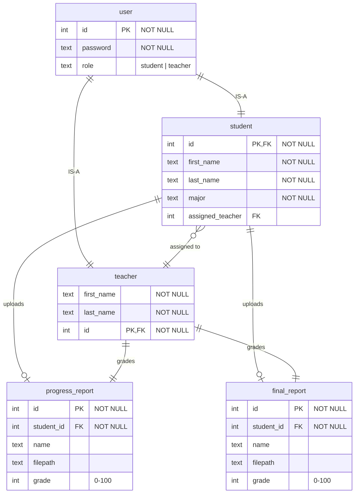

# Dissertation Management System

## Requirements Spec

based on original document and follow-up email, I haved designed the system with requirements/assumptions as follows:

- support user accounts using password only. session management and api authorization using basic http cookies.
- 3 types of roles: student, teacher (user accounts via database), admin (1 "account", hardcoded password in backend). each account gets redirected to a different portal.
- ONE teacher can grade multiple students' work.

### Student

- submit 2 reports: progress report, final report
  - the progress report can be resubmitted (e.g. student changed his/her dissertation research topic)
  - once the final report is submitted, it is considered complete submission to the system, and student cannot change anything
- report file supported types: `.docx`, `.pdf`
- submitted reports can be downloaded

### Teacher

- see his/her list of assigned students to mark the reports of
- download the student's reports
- input the grades (0-100) for **each** report; confirm and submit grades for **each** report
- once the final report's grades are confirmed, the record of each student is finalized

### Admin

- view all registered students in the system in a list and see their status:
  - progress and final report files (can download)
  - the grades of each report
  - the teacher responsible for each student
- can add students to the system by
  - entering their details
  - creating a password for them
  - assigning them to a teacher
    - teachers are given based by major ?

## System Spec

### App Structure

```text
/ (home page for login)
|__app/
  |__student (uploading reports)
  |__teacher (students list)
  |   |__:studentid  (1 student's page)
  |__admin (list of all students and teachers)
  |   |__add-student
```

### App Stack

- Frontend: Vue.js 3. Build with Vite
  - Composition API style, Javascript
  - Vue-Router for client side URL routing
  - Small app so just basic JS state management instead of using Pinia library
- Backend: Express.js on Node
  - session management and auth using HttpOnly cookies
  - SQLite database file
  - a folder to store all the report files from students

## API Spec

HTTP 1.1 REST API provided using `localhost:8080/api`.  

tried to just quickly implement a working api and database so some inefficient design decisions and shortcuts (e.g. all backend function in 1 `server.js`, admin is hardcoded into server code, etc) had to be taken.

### 1. Login and Logout (Student, Teacher)

enter a password and obtain a httponly cookie

#### Request

| Method | Endpoint | Content-Type | payload |
|-|-|-|-|
|POST|/users|application/json|  { "password": String } |
|DELETE|/users| application/json| - |

#### Response

1. Login (POST)

|Status| Content-Type |Response|
|-|-|-|
|201 Created| application/json | { "user": { <br> "role" : "student \| teacher" <br> "first_name" : String, <br> "last_name" : String } } |
|401 Unauthorized| application/json| { "error": "Incorrect password" }|
<!-- |500 Server Error| application/json | { "error" : "Something went wrong. Please try again later."} | -->

2. Logout (DELETE)

|Status|Content-Type|Response|
|-|-|-|
|204 No Content|-|-|
|401 Unauthorized|application/json|{ "error": "No cookie" }|
<!-- |500 Server Error| application/json | { "error" : "Something went wrong. Please try again later."} | -->

### 2. Login and Logout (Admin)

i hardcoded admin password for simplicity which is why a separate endpoint is needed. also just returns httponly cookie. response has no body.

#### Request

| Method | Endpoint | Content-Type | payload |
|-|-|-|-|
|POST|/admin|application/json|  { "password": String } |
|DELETE|/admin| application/json| - |

#### Response

|Status| Content-Type |Response|
|-|-|-|
|201 Created| application/json | | 
|401 Unauthorized| application/json| { "error": "Incorrect password" }|
<!-- |500 Server Error| application/json | { "error" : "Something went wrong. Please try again later."} | -->

### 3. Get Progress and Final Report Details (User)


