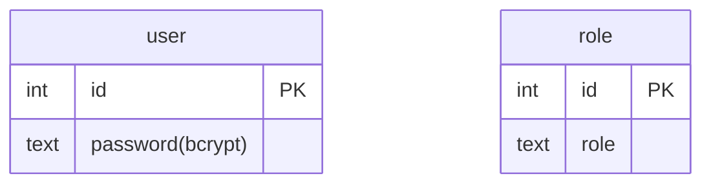

# Dissertation Management System

## Requirements Spec

based on original document and follow-up email, I haved designed the system with requirements/assumptions as follows:

- support user accounts using password only. session management and api authorization using basic http cookies.
- 3 types of roles: student, teacher (user accounts via database), admin (1 "account", hardcoded password in backend). each account gets redirected to a different portal.
- ONE teacher can grade multiple students' work.

### Student

- submit 2 reports: progress report, final report
  - the progress report can be resubmitted (e.g. student changed his/her dissertation research topic)
  - once the final report is submitted, it is considered complete submission to the system, and student cannot change anything
- report file supported types: `.docx`, `.pdf`
- submitted reports can be downloaded

### Teacher

- see his/her list of assigned students to mark the reports of
- download the student's reports
- input the grades (0-100) for **each** report; confirm and submit grades for **each** report
- once the final report's grades are confirmed, the record of each student is finalized

### Admin

- view all registered students in the system in a list and see their status:
  - progress and final report files (can download)
  - the grades of each report
  - the teacher responsible for each student
- can add students to the system by
  - entering their details
  - creating a password for them
  - assigning them to a teacher

## System Spec

### App Stack

- Frontend: Vue.js 3. Build with Vite
  - Composition API style, Javascript
  - Vue-Router for client side URL routing
  - Small app so just basic JS state management instead of using Pinia library
- Backend: Express.js on Node
  - session management and auth using HttpOnly cookies
  - SQLite database file
  - a folder to store all the report files from students

### Build/Serve

During frontend development I used Vite as the runtime tool. When frontend was finished I built the final app into static files into folder `/dist` and it can be served statically by the backend express server.  
i.e. backend server acts as both web server and api server.

## API Spec

HTTP 1.1 REST API provided using `localhost:[SERVER_PORT]/api`.  
-> default port is `8080`. can be changed in `.env.template`

tried to just quickly implement a working api and database so some inefficient design decisions and shortcuts (e.g. all backend function in 1 `server.js`, admin is hardcoded into server code and has its own api, etc) had to be taken.

### 1. Login and Logout (Student, Teacher)

enter a password and obtain a httponly cookie

#### Request

| Method | Endpoint | Content-Type | payload |
|-|-|-|-|
|POST|/users|application/json|  { "password": String } |
|DELETE|/users| application/json| - |

#### Response

1. Login (POST)

|Status| Content-Type |Response|
|-|-|-|
|201 Created| application/json | { "message": "logged in"   "user": {   "first_name" : String,   "last_name" : String } } | ds
|401 Unauthorized| application/json| { "error": "Incorrect pasword" }|

2. Logout (DELETE)

|Status|Content-Type|Response|
|-|-|-|
|204 No Content|-|-|
|401 Unauthorized|application/json|{ "error": "No cookie" }|
|404 Not Found|application/json|{ "error": "Session already logged out"}|

### 2. Upload File (Student)

